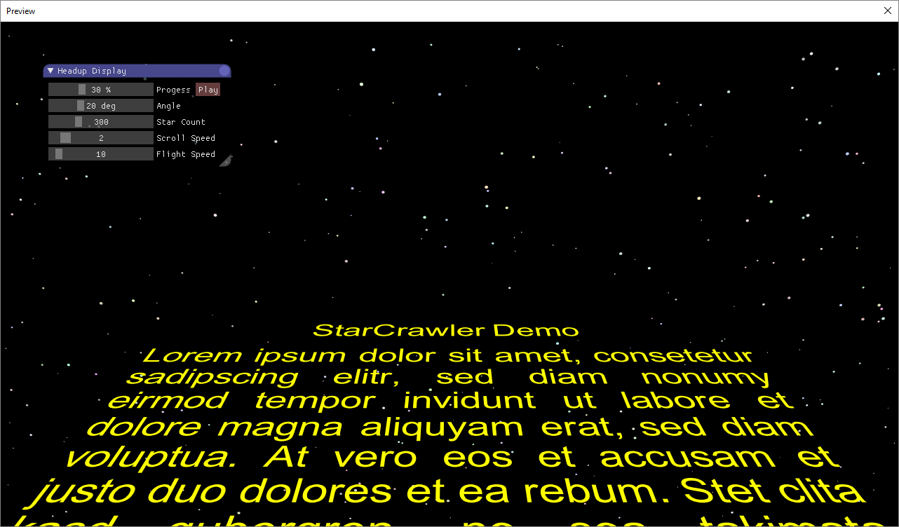
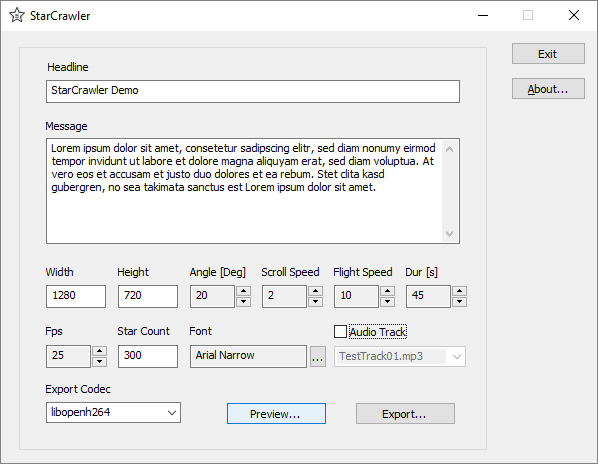

# StarCrawler
Another Star Wars like Intro Maker

This is more a **Demo** than a serious piece of software. Shows how to:

* use Windows API routine _GetGlyphOutline_
* project 3D objects to a 2D bitplane
* use SDL to present a raw bitplane on screen
* play encoded (e.g. MP3) audio tracks in realtime
* export a slideshow of images to MP4 video

Download pre compiled binaries from [`Releases`](https://github.com/Frank-Friemel/StarCrawler/releases)

### Third party libraries
* [`WTL`](https://sourceforge.net/projects/wtl) Windows Template Library
* [`SDL`](https://www.libsdl.org/) Simple Directmedia Layer
* [`GLM`](http://glm.g-truc.net) OpenGL Mathematics

Already included within this project is [Anti-Grain Geometry](http://www.antigrain.com)

### Powered by
* [FFmpeg](https://ffmpeg.org/) The _Swiss Army Knife_ amongst multimedia frameworks

### License
GPL

### Screen

